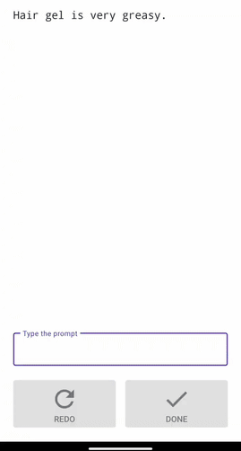

# Tap Typing with Touch Sensing Images (TSI) Dataset

This dataset is associated with the UIST 2024 paper titled
["Can Capacitive Touch Images Enhance Mobile Keyboard Decoding?"](https://doi.org/10.1145/3654777.3676420)
by Piyawat Lertvittayakumjorn, Shanqing Cai, Billy Dou, Cedric Ho, and Shumin
Zhai from Google.

## Abstract

This **Tap Typing with Touch Sensing Images (TSI) dataset** contains a
collection of touch points on a mobile touchscreen keyboard. Each touch point
corresponds to a user tap that was intended to enter a specific character via
the keyboard. This dataset was collected by asking 16 participants to copy-type
given prompts, so we can align each touch point with a character in the prompt
and construct pairs of (touch data, intended key) for training a keyboard
decoder. Uniquely, the TSI dataset includes not only the centroids of the user
taps, but also their elliptical features and capacitive sensing images (referred
to as "touch heatmaps" or simply "heatmaps" in our UIST paper), providing richer
information for keyboard decoding. In total, this TSI dataset consists of 43735
examples together with a keyboard layout file and a prompt file.

## Terminology

<p align="center">
  
  <br><em>Visualization of a sample touch point. The heatmap depicts the capacitive touch sensing image for this touch point. The red dot indicates the touch centroid derived from the touch sensing image. The red ellipse represents the touch ellipse fitted to this touch area. The solid and dashed lines illustrate the major and minor axes of the ellipse, respectively.</em>
</p>

-   **Touch point**: A single user tap on the touchscreen.
-   **Touch heatmap**: The capacitive **touch sensing image** of the user tap,
    i.e., a two-dimensional spatial data captured by the capacitive
    touchscreen’s contact sensors.
-   **Touch centroid**: The centroid of the touch area. This is derived from the
    touch sensing image using a certain algorithm in a touch controller, and it
    can be represented as a coordinate pair (x, y) with respect to the keyboard
    area (unit: pixels).
-   **Touch ellipse**: An ellipse fitted on the touch contact area, used as an
    estimate of the size and shape of the contact on the screen. It is also
    derived from the touch sensing image and can be represented using three
    features -- the length of the major axis of the ellipse, the length of the
    minor axis of the ellipse, and the orientation of the ellipse.
-   **Heatmap overlap vector**: A novel representation of touch sensing image
    (i.e., touch heatmap) presented in our
    [our UIST paper](https://doi.org/10.1145/3654777.3676420). It was devised
    specifically for keyboard decoding. In particular, it is a vector of N
    numbers corresponding to the overlapping areas between the heatmap cells and
    the N candidate keys.
-   **Prompt**: A phrase or a sentence that we asked the participants to
    copy-type when collecting touch data in this dataset.
-   **Reference character**: A character in the prompt that the user aimed to
    type.
-   **Language model scores**: The probabilities of the candidate keys given the
    previously committed text only (not related to the touch signal of the
    current tap to decode). In this dataset, we used a finite-state transducer
    (FST) language model which can predict the probability of the next character
    given a previous context of at most five words.

## Data collection and processing

The touch points in this dataset were collected during Study 3 in
[our UIST paper](https://doi.org/10.1145/3654777.3676420) by asking 16
participants to copy-type given prompts.

### Participant-inclusion criteria

A total of 16 participants (8 male, 7 female, 1 non-binary) were recruited for
this user study. The inclusion criteria included: 1) regularly uses typing on a
smartphone, 2) uses English as the primary language for mobile typing, and 3) no
vision or motor impairment that may affect the copy typing task in the user
study.

### Task details

Each user-study participant was asked to perform four separate typing task
blocks, each consisting of 30 text prompts to be copy-typed. The users were
instructed to type as quickly and as accurately as possible (with their usual
fast speed). Also, they were allowed to correct typing errors before each
submission, but this was not mandatory unless the difference between their
submitted text and the original prompt exceeded 60% of the prompt's length. They
were also given a 1-2 minute break before proceeding to the next block. The
total duration of the entire user-study session varied between 30 and 50 minutes
among the 16 participants (including the time they used to answer questionnaires
related to the study).

### Device and setup

We used two
[Pixel 6 Pro](https://support.google.com/pixelphone/answer/7158570#zippy=%2Cpixel-pro)
devices for data collection. Each participant used one of the phones provided by
the experimenter. These phones were held in the default portrait orientation and
configured to log touch sensing images during the study. We used an Android
application for showing prompts and collecting submitted texts and touch data. A
custom build of Gboard was used in this app. To collect as many touch points as
possible, we disabled intelligent keyboard features such as auto-correction,
next-word prediction, double-space period, and grammar check. We also disabled
the per-key visual and haptic feedback in the keyboard in order not to distract
the participants.

<p align="center">
  
  <br><br><em>An android application used for data collection. Though the suggestion bar was shown, we strongly discouraged the participants from tapping it so we could collect as many touch points as possible. Note that the screen was partially cropped to hide private or irrelevant information.</em>
</p>

### Prompt set construction

The 30 prompts presented as the text for copy-typing in each task block were
divided into two subsets:

1.  **English phrases**: 20 phrases or sentences from the
    [MacKenzie and Soukoreff (2003)](https://dl.acm.org/doi/abs/10.1145/765891.765971)
    sentences.
2.  **Random strings**: 10 strings of random characters chosen from the 26
    English letters, SPACE, and PERIOD. Each random string was exactly
    8-character long and does not have SPACE at the beginning or at the end to
    avoid visual ambiguity. These strings are considered **out-of-vocabulary
    (OOV)** unlike the English phrases.

The English phrases and random strings were mixed and shuffled randomly in order
in each block. The four blocks consisted of non-overlapping prompts. In
addition, the prompts were randomized in order among the participants.

By construction, all the possible intended keys of this dataset are **A-Z,
SPACE, and PERIOD (28 keys in total)**. The distributions of them are shown
below.

<p align="center">
  
  <br><em>Distributions of reference characters in the dataset (Left) from English phrases prompts only, (Middle) from random strings prompts only, (Right) from both types of prompts.</em>
</p>

### Touch point & Key alignment

We aligned touch points in the submitted string to the reference prompt. Since
the submitted string may contain errors, we used the Needleman–Wunsch algorithm
that supports insertion, omission, substitution, and transposition errors for
alignment
([Needleman and Wunsch, 1970](https://www.sciencedirect.com/science/article/abs/pii/0022283670900574)).
After that, we aligned deleted touch points by replaying the typing sequence
(including backspaces) step by step and performing the alignment, using the
Needleman–Wunsch algorithm, every time before a touch point was deleted. The
reference text for alignment was a prefix of the prompt (with 1 character longer
than the current text so far to allow an omission error). We only kept
alignments of those not being aligned during submitted touch point alignment. We
refer to Section 4.2 of
[our UIST paper](https://doi.org/10.1145/3654777.3676420) for more details.

## Data structure

There are three files in the data directory -- touch_data.csv,
keyboard_data.json, and prompt_data.csv.

### touch_data.csv

A few example rows of touch_data.csv are shown below.

```
participant_id,task_id,trial_id,timestamp_ms,ref_char,ref_char_index_in_prompt,first_frame_touch_x,first_frame_touch_y,first_frame_touch_major,first_frame_touch_minor,first_frame_touch_orientation,first_frame_touch_heatmap,first_frame_heatmap_overlap_vector,was_deleted,lm_scores
user01,task1,0,239529639,m,0,1108.0,519.0,152.0,117.0,0.0866699144244194,"[[8, 13, 20], [8, 14, 18], [9, 13, 203], [9, 14, 79], [10, 13, 98], [10, 14, 38]]","[0.0, 0.0, 0.0, 0.0, 0.0, 0.0, 0.0, 0.0, 0.0, 2.990625, 23.1728125, 1.3865625, 352.27718749999997, 63.215624999999996, 0.0, 0.0, 0.0, 0.0, 0.0, 0.0, 0.0, 0.0, 0.0, 0.0, 0.0, 0.0, 0.0, 0.0]",False,nan
user01,task1,0,239530001,y,1,757.0,145.0,172.0,164.0,-0.2208932489156723,"[[3, 8, 10], [3, 9, 14], [3, 10, 10], [4, 8, 70], [4, 9, 186], [4, 10, 57], [5, 8, 79], [5, 9, 208], [5, 10, 69], [6, 8, 17], [6, 9, 33], [6, 10, 19]]","[0.0, 0.0, 0.0, 0.0, 0.0, 2.0771875, 35.689375, 20.8834375, 0.0, 0.0, 0.0, 0.0, 0.0, 0.0, 0.0, 0.0, 0.0, 0.0, 0.0, 154.82625000000002, 42.425625, 0.0, 0.0, 0.0, 496.54812499999997, 0.0, 0.0, 0.0]",False,"[0.280352, 0.000941453, 0.0130359, 0.00083572, 0.140016, 0.0, 0.00124548, 0.00166307, 0.14564, 0.000782347, 0.00126418, 0.00368562, 0.00894826, 0.0, 0.14503, 0.000911226, 0.0, 0.00346484, 0.0061941, 0.00344941, 0.0256453, 0.0, 0.000969431, 0.0, 0.171604, 0.0, 0.0443219]"
user01,task1,0,239530213,SPACE,2,722.0,676.0,191.0,174.0,0.8444564342498779,"[[10, 7, 10], [10, 8, 44], [10, 9, 55], [10, 10, 15], [11, 7, 31], [11, 8, 196], [11, 9, 248], [11, 10, 35], [12, 7, 26], [12, 8, 123], [12, 9, 133], [12, 10, 23], [13, 7, 10], [13, 8, 18], [13, 9, 16], [13, 10, 10]]","[0.0, 47.33625, 34.07749999999999, 0.0, 0.0, 0.0, 0.0, 0.0, 0.0, 0.0, 0.0, 0.0, 0.0, 0.0, 0.0, 0.0, 0.0, 0.0, 0.0, 0.0, 0.0, 195.58625, 0.0, 0.0, 0.0, 0.0, 710.5999999999999, 0.0]",False,"[0.00334769, 7.19902e-05, 0.00282896, 4.7261e-07, 0.00174823, 6.74272e-05, 0.000600986, 0.0, 2.36306e-07, 0.0, 3.53734e-08, 0.00171801, 0.0, 0.000129763, 1.2671e-05, 0.0, 0.0, 0.00580491, 0.0110847, 0.00156668, 0.0, 0.000100176, 0.0, 7.08915e-07, 0.0, 0.0, 0.970917]"
...
```

This is a csv file containing 43735 lines (excluding the header line)
corresponding to 43735 touch points. The lines are sorted by participant_id,
then task_id, and then trial_id. While one user tap is usually long enough to
generate a series of touch sensing images, this dataset focuses only on the
first frame of the sequence. Therefore, we use the prefix **first_frame_** for
every touch signal field. Specifically, each touch point in touch_data.csv
consists of

-   **participant_id** (str): The ID of the participant who contributed this
    touch point (e.g., `user01`, `user02`, …, `user16`).
-   **task_id** (str): The task block of this participant where the touch point
    was collected. There are four possible values, i.e., `task1`, `task2`,
    `task3`, and `task4`.
-   **trial_id** (int): The trial in the task block where the touch point was
    collected. Since each task block consists of 30 prompts (i.e., 30 trials),
    possible values for trial_id are `0`, `1`, `2`, …, `29`.
-   **timestamp_ms** (int): The relative timestamp (in milliseconds) of the
    touch point. To clarify, it is the time elapsed since last reboot of the
    device. This can be used to compute the duration between taps in the same
    trial for example.
-   **ref_char** (str): The reference character that the user aimed to type
    (according to the alignment algorithm). Possible values include `a`, `b`,
    `c`, …, `z`, `SPACE`, and `.`. ***This is the field that the keyboard
    decoding task needs to predict.***
-   **ref_char_index_in_prompt** (int): The position of the reference character
    in the prompt.
-   **first_frame_touch_x** (float): The x coordinate of the touch centroid.
    `0.0` corresponds to the left-most side of the keyboard. `1440.0`
    corresponds to the right-most side of the keyboard.
-   **first_frame_touch_y** (float): The y coordinate of the touch centroid.
    `0.0` corresponds to **the top of the keyboard layout (not the top of the
    whole screen)**. `854.0` corresponds to the bottom of the keyboard layout.
-   **first_frame_touch_major** (float): The major axis length (in pixels) of
    the touch ellipse.
-   **first_frame_touch_minor** (float): The minor axis length (in pixels) of
    the touch ellipse.
-   **first_frame_touch_orientation** (float): The orientation (in radians) of
    the touch ellipse. As noted in
    [the Android developer reference](https://developer.android.com/reference/android/view/MotionEvent#AXIS_ORIENTATION),
    "An angle of 0 radians indicates that the major axis of contact is oriented
    upwards, is perfectly circular or is of unknown orientation. A positive
    angle indicates that the major axis of contact is oriented to the right. A
    negative angle indicates that the major axis of contact is oriented to the
    left. The full range is from -PI/2 radians (finger pointing fully left) to
    PI/2 radians (finger pointing fully right)."
-   **first_frame_touch_heatmap** (list[list[int]]): The sparse representation
    of the touch heatmap (touch sensing image). Although a full heatmap image of
    Pixel 6 Pro has 39 rows and 18 columns, this dataset keeps only the 16
    bottom rows of the image, which are sufficient to cover the whole keyboard
    area for the key decoding task. The heatmap is represented as a list of list
    of integers. The members of the outer list corresponds to non-zero cells in
    the heatmap image. Each of them is represented as a list of three numbers
    `[i, j, v]` meaning that the value of the heatmap cell at row `i` column `j`
    is `v`. Note that `i` ranges from `0` to `15`, while `j` ranges from `0` to
    `17` (0-indexed).
-   **first_frame_heatmap_overlap_vector** (list[float]): The heatmap overlap
    vector representation of the touch heatmap image. It is a vector of 28
    numbers corresponding to the overlapping area between the heatmap cells and
    the 28 candidate keys (`a`, `b`, `c`, …, `z`, `SPACE`, and `.` in this
    order). We refer to Section 3.1 of
    [our UIST paper](https://doi.org/10.1145/3654777.3676420) for more details.
-   **was_deleted** (bool): Whether the touch point was deleted by the
    participant. Possible values are `True` and `False`.
-   **lm_scores** (list[float]): The language model scores for `a`, `b`, ...,
    `z`, and `SPACE`. Note that our language model does not have the score for
    PERIOD (`.`).

<p align="center">
  
  <br><em>The visualization of the first example on the keyboard layout.</em>
</p>

### keyboard_data.json

Some example lines of keyboard_data.json are shown below.

```json
{
  "device_info": {
    "model": "Pixel 6 Pro",
    "whole_screen_width": 1440.0,
    "whole_screen_height": 3120.0,
    "num_all_heatmap_rows": 39,
    "num_all_heatmap_cols": 18,
    "num_valid_heatmap_rows": 16
  },
  "keyboard_info": {
    "keyboard_width": 1440.0,
    "keyboard_height": 854.0,
    "top_left_x_position": 0.0,
    "top_left_y_position": 2098.0,
    "most_common_key_width": 135.0,
    "most_common_key_height": 206.0
  },
  "keys_info": {
    "q": {
      "key_id": "q",
      "text_literal": "Q",
      "key_center_x": 112.0,
      "key_center_y": 131.0,
      "key_width": 135.0,
      "key_height": 206.0
    },
    "w": {
      "key_id": "w",
      "text_literal": "W",
      "key_center_x": 247.0,
      "key_center_y": 131.0,
      "key_width": 135.0,
      "key_height": 206.0
    },
    ...
  }
}
```

This json file contains information about the device and the keyboard used for
data collection. It consists of three major parts.

-   **device_info**: This indicates the device model, screen dimensions, and the
    dimensions of the heatmap image. Note that `num_valid_heatmap_rows` of 16
    means that this dataset contains only the data from the 16 bottom-most
    heatmap rows, which are sufficient to cover the entire keyboard layout for
    key decoding.
-   **keyboard_info**: This indicates the size of the keyboard and the most
    common key sizes. It also specifies the top-left position of the keyboard
    relative to the entire device screen.
-   **keys_info**: This contains information of each of the 28 candidate keys.
    For each key, it shows the position of the key center **with respect to the
    keyboard layout (not the entire screen)** and the size of the key.

<p align="center">
  
  <br><em>An illustration of the keyboard (the orange rectangle area) and its position on the entire screen (the grey rectangle). The device size and the keyboard size are annotated in the figure. The red dot represents the center of the key Q of which the position and the size are also annotated. The grid in the figure represents the array of capacitive touch sensors that generate the touch sensing images (touch heatmaps). The blue border highlights the region of the heatmaps recorded in this dataset (i.e., the 16 bottom rows). This figure can be drawn using the data in keyboard_data.json.</em>
</p>

### prompt_data.csv

A few example rows of prompt_data.csv are shown below.

```
participant_id,task_id,trial_id,prompt_type,prompt
user01,task1,0,phrase,My preferred treat is chocolate.
user01,task1,1,random,Rcgvifjs
user01,task1,2,phrase,You will loose your voice.
...
```

This file lists the prompts used during data collection. Each row has the
participant_id, the task_id, and the trial_id as the composite key and the
prompt_type (`phrase` or `random`) and the prompt text as values. The
prompt_data.csv can be used together with the touch_data.csv to figure out where
the reference character is in the prompt.

## Dataset Metadata

The following table is necessary for this dataset to be indexed by search
engines such as <a href="https://g.co/datasetsearch">Google Dataset Search</a>.
<div itemscope itemtype="http://schema.org/Dataset">
  <table>
    <tr>
      <th>property</th>
      <th>value</th>
    </tr>
    <tr>
      <td>name</td>
      <td><code itemprop="name">Tap Typing with Touch Sensing Images (TSI) Dataset</code></td>
    </tr>
      <tr>
      <td>description</td>
      <td><code itemprop="description">The Tap Typing with Touch Sensing Images (TSI) dataset contains data of user taps on a mobile touchscreen keyboard. Each tap is characterized by its centroid and elliptical features as well as its capacitive touch sensing image (TSI). The dataset aligns each tap with a key the user intended to type during data collection so it can be used for keyboard decoder training and/or evaluation. In total, this TSI dataset consists of 43,735 taps (from 16 participants performing copy-typing tasks) together with a keyboard layout file and a prompt file.</code></td>
    </tr>
    </tr>
      <tr>
      <td>sameAs</td>
      <td><code itemprop="sameAs">https://github.com/google-research-datasets/tap-typing-with-touch-sensing-images</code></td>
    </tr>
  </table>
</div>

## Citation

If you use or refer to the TSI dataset, please cite the following paper.

```txt
@misc{lertvittayakumjorn2024can,
      title={Can Capacitive Touch Images Enhance Mobile Keyboard Decoding?}, 
      author={Piyawat Lertvittayakumjorn and Shanqing Cai and Billy Dou and Cedric Ho and Shumin Zhai},
      year={2024},
      eprint={2410.02264},
      archivePrefix={arXiv},
      primaryClass={cs.HC},
      url={https://arxiv.org/abs/2410.02264}, 
}
```

## Contact

Piyawat Lertvittayakumjorn (firstname [at] google [dot] com)
